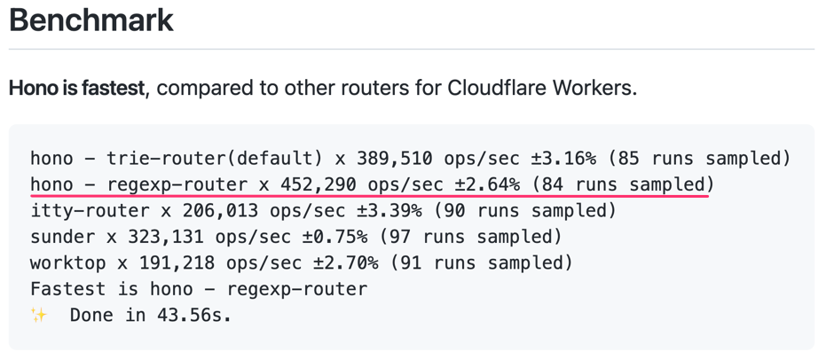

# JS のウェブフレームワークで<br />高速なルーターを<br />実装する方法

天野卓@2022年6月25日

---

<!-- class: image -->


https://github.com/honojs/hono

---

> Hono - [炎] means flame in Japanese - is a small, simple, and ultrafast web framework for Cloudflare Workers or Service Worker based serverless such as Fastly Compute@Edge.

https://github.com/honojs/hono/blob/master/README.md

---

.png)
https://zenn.dev/yusukebe/articles/0c7fed0949e6f7

---


https://workers.cloudflare.com/

---

### Cloudflare Workers

> Cloudflare Workers uses the V8 JavaScript engine from Google Chrome. The Workers runtime is updated at least once a week, to at least the version that is currently used by Chrome’s stable release. This means you can safely use the latest JavaScript features, with no need for transpilers.
>
> All of the standard built-in objects supported by the current Google Chrome stable release are supported, with a few notable exceptions:

https://developers.cloudflare.com/workers/runtime-apis/web-standards/

---

.png)

https://yusukebe.com/posts/2022/cloudflare-workers-not-only-for-ssr/

---

## 今日話すこと

---



https://github.com/honojs/hono

---

### 注意事項

* ベンチマークは`node:18.4`のdocker imageで計測
  * ホストはEC2の`c5.large`
  * エンジンはCloudflare Workersと同じV8なので、この環境で最適化できれば概ねOK（？）
  * ([Compute@EdgeはSpiderMonkey](https://github.com/fastly/js-compute-runtime)らしい)
* 環境やバージョンが異なると性能の傾向も異なるかも

---

## さて

---

## ルーターの仕事

---

<!-- class: code70 -->

```typescript
const app = new Hono();

app.get("/", function a() {});
app.get("/users/:id", function b() {});
app.get("/users/:id/posts", function c() {});
```

```
GET /
=> a
```

```
GET /users/1
=> b
```

```
GET /users/1/posts
=> c
```

---

## 素朴な実装

---

<!-- class: code80 -->

```typescript
const routes = [
  [/^\/$/, a],
  [/^\/users\/[^/]+$/, b],
  [/^\/users\/[^/]+\/posts$/, c],
];
//ここまでを事前に用意しておく

const path = request.url.replace(/https?:\/\/[^/]+/, "");
// 実行時にリクエストオブジェクトからパスを取り出す

for (const [regexp, handler] of routes) {
  if (regexp.test(path)) {
    return handler;
  }
}
```

---

## 木構造を使う実装

---

<!-- class: image-h -->



---

<style>
  li  {
    line-height: 1.5;
    margin-bottom: 0.5em;
  }
</style>

### 木構造を使う実装

* JS上での実装でも結構速度はでる
* :idの文字種を制限しない場合には、ノードでの文字列の一致も省略することができ、実行時には1度も正規表現による一致を行わずに同値の比較だけで高速に探索することができる
* コードもシンプルで直観的なものにしやすい

---

## もっと速くしたい

---

<!-- _class: code0 -->

### 文字列の一致に特化した機能といえば🤔

---

## 正規表現

---

## Perlでの先行事例
## Router::Boom
#### https://metacpan.org/dist/Router-Boom

---

### Perlでできること

```
use re 'eval';

my @routes = ($a, $b, $c);

my @c = ();
my $m = undef;

$path =~ m{
  \A/(?:\z(?{$m=0})
  |users/([^/]+)(?:\z(?{$m=1;@c=($1)})
  |/posts\z(?{$m=2;@c=($1)})))
}x;
```

---

### JavaScriptでできること（抜粋）

```typescript
const re = /^\/(?:$()|users\/([^\/]+)(?:$()|\/posts$()))/;
const matchResult = path.match(re);
routeData[matchResult.indexOf("", 1)];
```

---

### JavaScriptでできること（全体）

```typescript
const routeData: [number, Array<[string, number]>][] = [];
routeData[1] = [a, []];
routeData[3] = [b, [["id", 1]]];
routeData[4] = [c, [["id", 1]]];
const re = /^\/(?:$()|users\/([^\/]+)(?:$()|\/posts$()))/;
//ここまでを事前に用意しておく

const matchResult = path.match(re);
if (matchResult) {
  const [handler, paramMap] = routeData[matchResult.indexOf("", 1)];

  const pathParams = {}
  for (const [key, index] of paramMap) {
    pathParams[key] = matchResult[index];
  }
  return [handler, pathParams];
}
```

---

### 実行時の処理を以下の関数の<br />呼び出しのみで済むようにする

* String.prototype.match()
* Array.prototype.indexOf()

---

### String.prototype.match()

* トライ木から正規表現を生成してRegExpオブジェクトを作っておいて、それを適用する。

---

<b>JSでわざわざトライ木でまとめる必要はあるの？</b>

---

<!-- class: code95 -->

```typescript
const prefix = Array.from({ length: 1000 }, () => "prefix").join("");
const re = new RegExp(Array.from({ length: 26 }, (_, k) =>
  `${prefix}${String.fromCharCode("a".charCodeAt(0) + k)}`
).join("|"));
// `${prefix}a|${prefix}b|${prefix}c|...`

suite
  .add("a", () => {
    re.test(`${prefix}a`);
  })
  .add("z", () => {
    re.test(`${prefix}z`);
  })
  .run();
```

```
a x 326,194 ops/sec ±0.61% (91 runs sampled)
z x 334,725 ops/sec ±0.72% (92 runs sampled)
```

---

<!-- class: code95 -->

```typescript
const prefix = Array.from({ length: 1000 }, () => "prefix").join("");
const re = new RegExp(Array.from({ length: 26 }, (_, k) =>
  `with-(capture)${prefix}${String.fromCharCode("a".charCodeAt(0) + k)}`
).join("|"));
// `with-(capture)${prefix}a|with-(capture)${prefix}b|...`

suite
  .add("a", () => {
    re.test(`with-capture${prefix}a`);
  })
  .add("z", () => {
    re.test(`with-capture${prefix}z`);
  })
  .run();
```

```
a x 301,888 ops/sec ±0.54% (93 runs sampled)
z x 272,048 ops/sec ±0.42% (96 runs sampled)
```

---

<!-- class: code95 -->

```typescript
const prefix = Array.from({ length: 1000 }, () => "prefix").join("");
const re = new RegExp(
  `with-(capture)(?:${...})`
).join("|"));
// `with-(capture)(?:${prefix}a|${prefix}b|${prefix}c|...`

suite
  .add("a", () => {
    re.test(`with-capture${prefix}a`);
  })
  .add("z", () => {
    re.test(`with-capture${prefix}z`);
  })
  .run();
```

```
a x 310,702 ops/sec ±0.58% (93 runs sampled)
z x 314,374 ops/sec ±0.92% (88 runs sampled)
```

---

### Array.prototype.indexOf()

* indexOf() は計算量としては `O(n)` だけれども
  * ウェブフレームワークのルーティングなので、nはそれほど大きくならない
  * nが大きくなければ、JSで頑張るよりもindexOfを使った方が速い

---

## ここまでで、<br />探索については高速になりました

---

## もうちょっとだけ続くんじゃ

---

### 最初に出したルーティング定義の例

<!-- class: code80 -->

```typescript
const app = new Hono();

app.get("/", function a() {});
app.get("/users/:id", function b() {});
app.get("/users/:id/posts", function c() {});
```

---

### ミドルウェアを適用する例

```typescript
const app = new Hono();

app.all("*", logger);
app.all("/api/*", cors);
app.get("/api/users/:id", function handler() {});
app.all("/api/*", fallback);
```

---

```typescript
const routes = [
  [/^\//, logger],
  [/^\/api(?:$|\/)/, cors],
  [/^\/api\/users\/[^/]+$/, handler],
  [/^\/api(?:$|\/)/, fallback],
];
//ここまでを事前に用意しておく

const path = request.url.replace(/https?:\/\/[^/]+/, "");

const handlers = [];
for (const [regexp, handler] of routes) {
  if (regexp.test(path)) {
    handlers.push(handler);
  }
}

return handlers.reduceRight((prev, current) => {
  current(() => prev())
}, () => undefined)
```

---

雰囲気としてはこんな感じ

```typescript
logger(() => {
  cors(() => {
    handler(() => {
      fallback();
    });
  });
});
```

---

<!-- class: image-h -->


---


---


---

<!-- class: code80 -->

Honoでは、ここまでがルーターの仕事

```typescript
const routes = [
  [/^\//, logger],
  [/^\/api(?:$|\/)/, cors],
  [/^\/api\/users\/[^/]+$/, handler],
  [/^\/api(?:$|\/)/, fallback],
];
//ここまでを事前に用意しておく

const path = request.url.replace(/https?:\/\/[^/]+/, "");

const handlers = [];
for (const [regexp, handler] of routes) {
  if (regexp.test(path)) {
    handlers.push(handler);
  }
}

return handlers
```

---

これ相当の処理は別の場所で行う

```typescript
return handlers.reduceRight((prev, current) => {
  current(() => prev())
}, () => undefined)
```

---

```typescript
const app = new Hono();

app.all("*", logger);
app.all("/api/*", cors);
app.get("/api/users/:id", function handler() {});
app.all("/api/*", fallback);
```

```
GET /api/users/1
=> [logger, cors, handler, fallback]
```

---

複数のミドルウェア/ハンドラを探して返すのは、
正規表現一発で探すのと相性が悪いのでは？

```typescript
const re = /^\/(?:$()|users\/([^\/]+)(?:$()|\/posts$()))/;
```

---

<!-- class: image-h -->


---

殆どのユースケースで
以下のようになっているはず。
<br />

* 探すべきなのは1つのハンドラである
* ハンドラに適用されるミドルウェアは決まっている


---

<!-- _class: code95-left -->


```typescript
const app = new Hono();

app.all("*", logger);
app.all("/api/*", cors);
app.get("/api/users/:id", function handler() {});
app.all("/api/*", fallback);
```

つまりここで探し出したいのは`handler`であり、
かつ`handler`が見つかったときには、常に

```
[logger, cors, handler, fallback]
```

が返されるはず。

---

<!-- class: code95 -->

```typescript
const routeData: [number, Array<[string, number]>][] = [];
routeData[1] = [a, []];
routeData[3] = [b, [["id", 1]]];
routeData[4] = [c, [["id", 1]]];
const re = /^\/(?:$()|users\/([^\/]+)(?:$()|\/posts$()))/;
//ここまでを事前に用意しておく

const path = request.url.replace(/https?:\/\/[^/]+/, "");

const matchResult = path.match(re);
if (matchResult) {
  const [handler, paramMap] = routeData[matchResult.indexOf("", 1)];

  const pathParams = {}
  for (const [key, index] of paramMap) {
    pathParams[key] = matchResult[index];
  }
  return [handler, pathParams];
}
```

---

```typescript
const 🧅a = [ logger, cors, a ];
const 🧅b = [ logger, basicAuth, b ];
const 🧅c = [ logger, basicAuth, c ];
```

---

```typescript
const routeData: [number, Array<[string, number]>][] = [];
routeData[1] = [🧅a, []];
routeData[3] = [🧅b, [["id", 1]]];
routeData[4] = [🧅c, [["id", 1]]];
const re = /^\/(?:$()|users\/([^\/]+)(?:$()|\/posts$()))/;
//ここまでを事前に用意しておく

const matchResult = url.match(re);
if (matchResult) {
  const [handler, paramMap] = routeData[matchResult.indexOf("", 1)];

  const pathParams = {}
  for (const [key, index] of paramMap) {
    pathParams[key] = matchResult[index];
  }
  return [handler, pathParams];
}
```

---

### 🧅の作り方

```typescript
const app = new Hono();

app.all("*", logger);
app.all("/api/*", cors);
app.get("/api/users/:id", function handler() {});
app.all("/api/*", fallback);
```

---

登録された状態
```typescript
[
  // [パス, 登録順, ハンドラ]
  ["*", 0, logger],
  ["/api/*", 1, cors],
  ["/api/users/:id", 2, handler],
  ["/api/*", 3, fallback],
]
```

---

パスの抽象度の高い順に並べ替えを行い、
上のパスに含まれていれば同じ🧅になると考える
```typescript
[
  ["*", 0, logger],
  ["/api/*", 1, cors],
  ["/api/*", 3, fallback],
  ["/api/users/:id", 2, handler],
]
```

---

登録順に並べ替えをし直す
```typescript
[
  ["*", 0, logger],
  ["/api/*", 1, cors],
  ["/api/users/:id", 2, handler],
  ["/api/*", 3, fallback],
]
```

---

ハンドラだけ取り出す
```typescript
🧅 = [
  logger,
  cors,
  handler,
  fallback,
]
```

---

### 例外もある

---

<!-- _class: code95-left -->

以下のケースではハンドラ`b`に適用されるミドルウェアは
決まって<del>いる</del>いない

```typescript
const app = new Hono();

app.get("/", function a() {});
app.get("/:type/subtype/:action", function a() {});
app.get("/users/:id/posts", function b() {});
```

```
GET /users/1/posts
=> [b]
```

```
GET /users/subtype/create
=> [a, b]
```

---

reg-exp-routerでも
このような例外的なケースも一応対応している。
が、このケースではtrie-routerの方が速い。


---

## まとめ

---

### reg-exp-routerの速さのポイント

* 1つの正規表現にまとめて、1度の適用で探索
* 🧅をたくさん用意しておいて、URLに一致する🧅を探す

---

## おまけ

---

## どれが速い？

* `join` / `+=`
* `indexOf` / `lastIndexOf`
* `split("/")` / `split(/\//)`
* `for` / `forEach` / `for-of`

(V8とSpiderMonkeyで違いがあります)

---

### `join` / `+=`

```typescript
const strings = Array.from({ length: 1000 }, () => "hello");

suite
  .add("join", () => {
    return strings.join("");
  })
  .add("+=", () => {
    let res = "";
    strings.forEach((str) => (res += str));
    return res;
  })
  .add("reduce", () => {
    return strings.reduce((res, str) => res + str, "");
  })
  .run();
```

---

```
join x 48,489 ops/sec ±2.26% (97 runs sampled)
+= x 105,353 ops/sec ±1.63% (97 runs sampled)
reduce x 130,151 ops/sec ±3.11% (93 runs sampled)
Fastest is join by reduce
```

---

### `indexOf` / `lastIndexOf`

```typescript
const re = new RegExp([...Array(1000)].map((_, i) =>
  `/${i}$()`
).join("|"));
const m = "/500".match(re);

suite
  .add("indexOf()", () => {
    return m.indexOf("");
  })
  .add("lastIndexOf()", () => {
    return m.lastIndexOf("");
  })
  .run();
```

---

```
indexOf() x 340,204,824 ops/sec ±0.69% (88 runs sampled)
lastIndexOf() x 545,046 ops/sec ±0.76% (94 runs sampled)
Fastest is indexOf()
```

* indexOf()は[C++](https://github.com/v8/v8/blob/5dd39b1de19a2fd43e4140a81eb37a3430e594b8/src/compiler/js-call-reducer.cc#L2026)
* lastIndexOf()は[Torque](https://github.com/v8/v8/blob/db50b4912875606e2d85cb8fe7f6c6281fc65b2d/src/builtins/array-lastindexof.tq)


---

### `split("/")` / `split(/\//)`

```typescript
const string = process.argv[process.argv.length - 1] || "/";

suite
  .add(`"/"`, () => {
    return string.split("/");
  })
  .add("/\\//", () => {
    return string.split(/\//);
  })
  .run();
```

---

```
"/" x 4,386,136 ops/sec ±0.27% (98 runs sampled)
/\// x 9,975,101 ops/sec ±0.24% (95 runs sampled)
Fastest is /\//
```

---

<!-- _class: image -->


---
	
|       |         "/" |       /\\// |
| ----: | ----------: | ----------: |
|    10 | 1913225.672 | 2705181.449 |
|   100 |  308134.289 |  297026.579 |
|  1000 |   33429.193 |   27861.556 |

---

String.prototype.splitは[C++](https://github.com/v8/v8/blob/4bdbccc392e19a12c31ea9d7d8ff8b8ab1527762/src/builtins/builtins-string-gen.cc#L1319-L1320)

---

<!-- class: image-h2 -->


https://developer.mozilla.org/ja/docs/Web/JavaScript/Reference/Global_Objects/RegExp/@@split

---

```javascript
const splitter = {};
splitter[Symbol.split] = function (){
  return ["42"];
}

console.log("test".split(splitter)); // => ["42"]
```

---

#### V8のコメントの抜粋

* // Redirect to splitter method if {separator[@@split]} is not undefined.
  * RegExpの場合には（おそらく）ここで処理されて返る
* // String and integer conversions.
* // Shortcut for {limit} == 0.
* // If the separator string is empty then return the elements in the subject.
* ...

---

<!-- class: image0 -->

### いっそindexOfを使った方が速いのでは🤔

---

<!-- _class: code95-left -->

```typescript
function splitByIndexOf(str: string, sep: string): string[] {
  const res: string[] = [];
  for (let i = 0, j = str.indexOf(sep); ; j = str.indexOf(sep, i)) {
    if (j === -1) {
      res.push(str.substring(i));
      break;
    } else {
      res.push(str.substring(i, j));
      i = j + 1;
    }
  }
  return res;
}
```

※ limitには未対応


---

```typescript
const string = process.argv[process.argv.length - 1] || "/";

suite
  .add(`"/"`, () => {
    return string.split("/");
  })
  .add("/\\//", () => {
    return string.split(/\//);
  })
  .add("splitByIndexOf", () => {
    return splitByIndexOf(string, "/");
  })
  .run();
```

---

<!-- _class: image -->


---

|       |         "/" |       /\\// | splitByIndexOf |
| ----: | ----------: | ----------: | -------------: |
|    10 | 1913225.672 | 2705181.449 |    2514207.636 |
|   100 |  308134.289 |  297026.579 |     267884.594 |
|  1000 |   33429.193 |   27861.556 |      25881.830 |

---

```typescript
suite
  .add(
    `"/"`,
    () => string.split("/"),
    {
      onStart: () => delete String.prototype[Symbol.split],
    }
  )
  .add(
    "prototype",
    () => string.split("/"),
    {
      onStart: () =>
        String.prototype[Symbol.split] = splitByIndexOf,
    }
  )
```

---

<!-- _class: image -->


---

### `for` / `forEach` / `for-of`

---

### 参照するべき記事

* [JavaScriptのループはどれが一番高速なのか](https://qiita.com/keroxp/items/67804391a8d65eb32cb8)
  * forとwhileを使った高速な書き方
* [結局JavaScriptの配列ループはどれが一番速いのか](https://zenn.dev/itte/articles/737a3ca709aad0)
  * forEachやfor-ofも含めてどのような傾向にあるのか？

---

https://github.com/usualoma/ultrafast-js-router/blob/main/benchmark/for-sum.ts

---

```
while x 13,837,421 ops/sec ±0.31% (97 runs sampled)
for x 13,904,145 ops/sec ±0.68% (92 runs sampled)
for with len x 13,942,264 ops/sec ±1.15% (99 runs sampled)
for with decrement x 7,646,750 ops/sec ±0.21% (96 runs sampled)
forEach x 4,837,059 ops/sec ±0.08% (100 runs sampled)
reduce x 7,477,822 ops/sec ±1.64% (98 runs sampled)
for-of x 5,279,595 ops/sec ±0.20% (97 runs sampled)
Fastest is for
```

---

https://github.com/usualoma/ultrafast-js-router/blob/main/benchmark/for-mul.ts

---

```
while x 5,340,699 ops/sec ±0.19% (98 runs sampled)
for x 5,312,270 ops/sec ±0.58% (98 runs sampled)
for with len x 6,251,252 ops/sec ±0.55% (94 runs sampled)
for with decrement x 5,374,107 ops/sec ±0.21% (100 runs sampled)
forEach x 5,178,295 ops/sec ±1.84% (98 runs sampled)
for-of x 4,522,059 ops/sec ±0.10% (97 runs sampled)
Fastest is for with len
```

